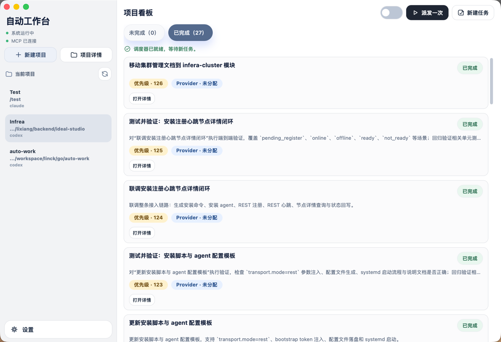
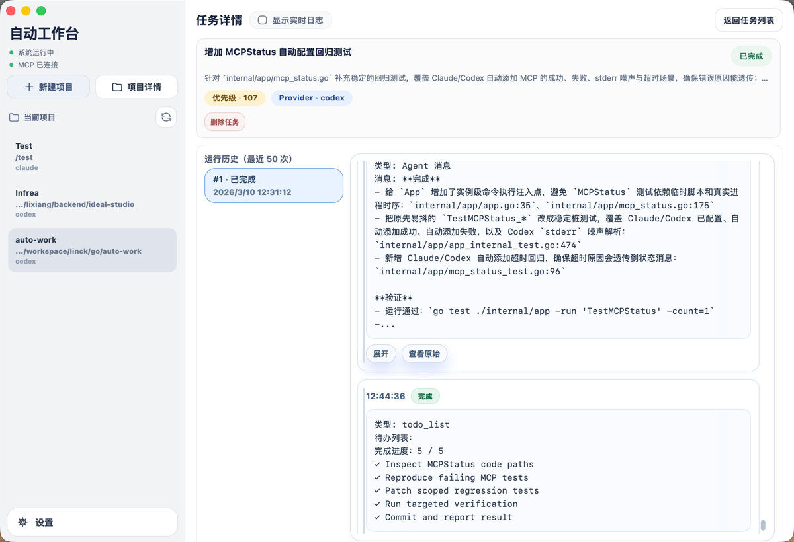
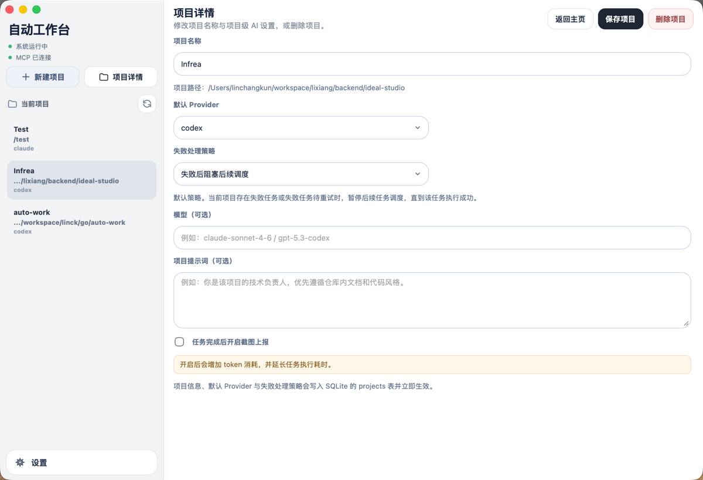
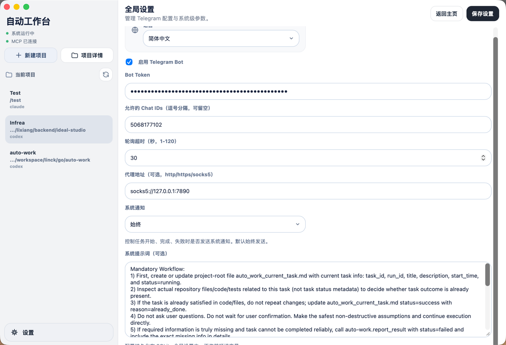
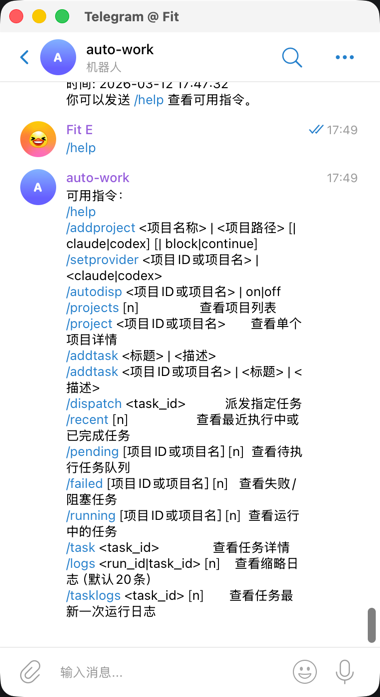
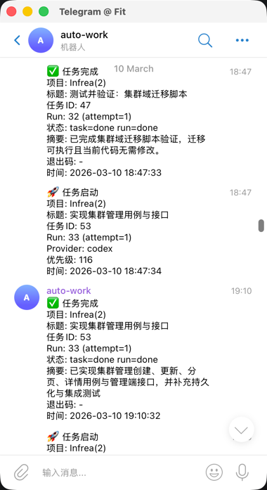

# auto-work

English | [简体中文](./README-zh.md)

`auto-work` is a local-first AI task orchestration desktop app for turning "ask Claude/Codex to do work" into a structured workflow with projects, task queues, execution logs, MCP callbacks, and follow-up task management.

Built with `Go + Wails + React + SQLite`, it is designed for people managing multiple code repositories locally. You can maintain per-project task queues, choose a default provider, control auto-dispatch behavior, and let AI write results back through the built-in MCP server after each run.

## When It Fits Well

- You manage multiple code repositories and want one place for AI-driven task execution
- You want to move from ad-hoc chat prompts to queue-based task orchestration
- You want run history, status write-back, and logs for every task
- You want Telegram notifications and basic task operations on mobile
- You want everything to stay local instead of relying on a hosted task platform

## Core Features

- Project-based task board for managing task status, priority, and run history
- Dual provider support for `Claude` and `Codex`
- Auto-dispatch for idle agents, plus manual one-click dispatch
- Built-in MCP server with tools such as `report_result`, `create_tasks`, `update_task`, and `delete_task`
- Traceable execution with summaries, details, run events, and logs
- Telegram integration for notifications, task queries, and task creation
- Project-level AI settings including model, prompt, failure policy, and screenshot reporting
- Local persistence with SQLite

## Documentation

- English: [README.md](./README.md)
- 简体中文: [README-zh.md](./README-zh.md)

## Screenshots

### Task List



The home screen shows the current project's task queue, run controls, and task cards for everyday dispatch and monitoring.

### Task Detail



The detail page shows recent runs, summaries, full result details, and live or historical logs.

### Project Detail



Each project can define its default provider, model, failure policy, project prompt, and screenshot reporting settings.

### Global Settings



Global settings centralize Telegram configuration, system notifications, and the global system prompt.

### Telegram Commands



Once Telegram is enabled, you can query projects, create tasks, and inspect pending or running work directly from chat.

### Telegram Task Notifications



Task started, completed, failed, or blocked events can be pushed to Telegram together with summaries and screenshot links.

## Tech Stack

- Backend: Go 1.23, Wails v2, SQLite
- Frontend: React 18, TypeScript, Vite
- Integrations: Claude CLI, Codex CLI, Telegram Bot, MCP HTTP Server

## Quick Start

### 1. Install Dependencies

Make sure you have these installed:

- Go `1.23+`
- Node.js and npm
- Wails CLI
- Optional: `claude` CLI and `codex` CLI if you want real AI task execution

Install the Wails CLI:

```bash
go install github.com/wailsapp/wails/v2/cmd/wails@latest
```

Install frontend dependencies:

```bash
make frontend-install
```

### 2. Start in Development Mode

```bash
make dev
```

Run Go tests only:

```bash
make test
```

Build the desktop app:

```bash
make build
```

### 3. First-Time Workflow

1. Start the app and create a project with a local repository path.
2. Open project settings and choose the default provider, model, and failure policy.
3. Create a task from the home screen.
4. Dispatch it manually or enable auto-dispatch.
5. Open task details to inspect logs, summaries, and run history.
6. Configure Telegram later if you want mobile notifications.

## Usage

### Projects and Tasks

- A project is the top-level container for tasks and is bound to a local repository path.
- New tasks are appended to the end of the project's queue by default.
- Tasks can also be inserted after another task through MCP.
- Tasks support editing, deletion, retry, and manual completion.
- Supported task states are `pending`, `running`, `done`, `failed`, and `blocked`.

### Providers and Dispatch

- Each project can choose a default provider: `claude` or `codex`.
- When auto-dispatch is enabled, the scheduler keeps picking dispatchable tasks for that project.
- Manual dispatch is useful for single-task execution or environment debugging.
- Failure policies:
  - `block`: stop later tasks in the same project after a failure
  - `continue`: allow other pending tasks to continue even if one task fails

### Result Write-Back

- Every execution creates a run record with events and key logs.
- When AI finishes a task, it is expected to call `auto-work.report_result` through the built-in MCP server.
- AI can also create follow-up tasks, update existing tasks, or delete invalid ones through MCP.

### Telegram Integration

- Receive notifications for task start, completion, failure, and blocked states
- Query projects, pending tasks, recent runs, and logs from Telegram
- Create tasks from chat with `/addtask`

See:

- [Telegram Bot Setup Guide](docs/04-telegram-bot-setup.md)
- [Telegram Command Reference](docs/05-telegram-commands.md)

### Frontend Screenshot Reporting

- Enable "screenshot reporting after task completion" in project settings.
- When a task modifies frontend-related files, AI can add screenshot links to the result details.
- Telegram notifications will include screenshot links and may send local images directly when available.

## Common Startup Modes

### Default

```bash
make dev
```

### Custom Database Path

```bash
AUTO_WORK_DB_PATH=/abs/path/auto-work.db make dev
```

### Disable Default Auto Execution

```bash
AUTO_WORK_RUN_CLAUDE_ON_DISPATCH=0 make dev
AUTO_WORK_RUN_CODEX_ON_DISPATCH=0 make dev
```

### Set Default Models

```bash
AUTO_WORK_CLAUDE_MODEL=claude-sonnet-4-6 \
AUTO_WORK_CODEX_MODEL=gpt-5.3-codex \
make dev
```

### Enable and Require MCP Callback

```bash
AUTO_WORK_ENABLE_MCP_CALLBACK=1 \
AUTO_WORK_REQUIRE_MCP_CALLBACK=1 \
make dev
```

### Custom MCP HTTP URL

```bash
AUTO_WORK_MCP_HTTP_URL=http://127.0.0.1:39123/mcp make dev
```

Notes:

- The default database path is `./data/auto-work.db`
- App logs are written to `./data/log/auto-work.log`
- Environment variables mainly provide startup defaults; some settings can later be changed in the UI

## MCP Tools

The in-process MCP server currently exposes:

- `auto-work.report_result`
- `auto-work.create_tasks`
- `auto-work.update_task`
- `auto-work.delete_task`
- `auto-work.list_pending_tasks`
- `auto-work.list_history_tasks`
- `auto-work.get_task_detail`

If you want to access `auto-work` MCP from standalone Claude Code or Codex sessions in your terminal, see:

- [MCP Configuration and Troubleshooting](docs/06-mcp-config.md)

## Repository Docs

Most files under `docs/` are currently written in Chinese.

- [English README](./README.md)
- [中文 README](./README-zh.md)
- [Architecture](docs/01-architecture.md)
- [Development Plan](docs/02-dev-plan.md)
- [MVP Acceptance](docs/03-mvp-acceptance.md)
- [Telegram Bot Setup Guide](docs/04-telegram-bot-setup.md)
- [Telegram Command Reference](docs/05-telegram-commands.md)
- [MCP Configuration and Troubleshooting](docs/06-mcp-config.md)

## Development Commands

```bash
make help
make tidy
make fmt
make test
make frontend-install
make frontend-build
make dev
make build
```

## License

Add a `LICENSE` file before publishing the repository if you plan to open source it on GitHub.
